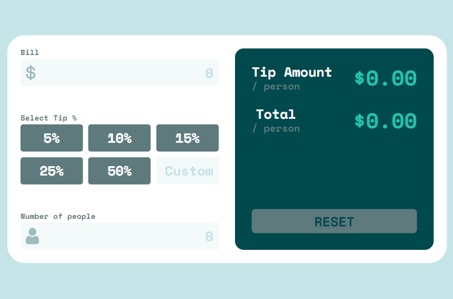

# Frontend Mentor - Tip calculator app solution

This is a solution to
the [Tip calculator app challenge on Frontend Mentor](https://www.frontendmentor.io/challenges/tip-calculator-app-ugJNGbJUX).
Frontend Mentor challenges help you improve your coding skills by building realistic projects.

## Table of contents

- [Overview](#overview)
    - [Links](#links)
    - [The challenge](#the-challenge)
    - [Screenshot](#screenshot)
- [My process](#my-process)
    - [Built with](#built-with)
    - [Мath calculations](#Math-calculations)
    - [What I learned](#what-i-learned)
- [Author](#author)

## Overview

### Links

Live solution URL: [Tap here 👈](https://mister-mandarin.github.io/Tip-calculator-app)

### The challenge

Users should be able to:

- View the optimal layout for the app depending on their device's screen size
- See hover states for all interactive elements on the page
- Calculate the correct tip and total cost of the bill per person

### Screenshot



## My process

### Built with

- Semantic HTML5 markup
- CSS custom properties
- Flexbox
- CSS Grid
- [React](https://reactjs.org/) - JS library

### Math calculations

- Tip Amount = Bill / Number of people * (select tip / 100)
- Total = Bill / Number of people + Tip Amount

### What I learned

I spent a whole 5 hours to think of this final piece of code!!!

```js
 useEffect(() => {
    setValue('')
}, [clean]);
```

## Author

- GitHub - [@mister-Mandarin](https://github.com/mister-Mandarin)
- Frontend Mentor - [@mister-Mandarin](https://www.frontendmentor.io/profile/mister-Mandarin)
- VK - [@Andrey](https://vk.com/andrei_poluektov)
- Instagram - [@Mandarin](https://www.instagram.com/andrey_poluehktov/)
